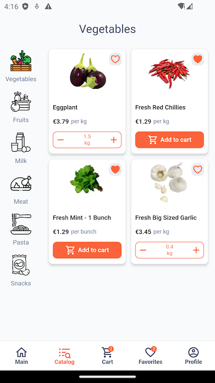

# GroceryApp

An application for ordering products in an online grocery store.




## Generate files
### Injections,  `json_serializable`-models and `freezed`-states:
After adding some new injectable or injecting class need to generate file injection.config.dart, for this do next tasks: update pubspec dependencies and
```sh
dart run build_runner build --delete-conflicting-outputs
```

<br />

### Localization and translations
- Need to install the extension in the IDE: `Flutter Intl`

<br />

## Import sorter command (execute after task completion)
```sh
dart run import_sorter:main
```

<br />

## Fix some problems
If after second step happens error, project needs to clean:

1. flutter clean
2. flutter packages pub get
3. flutter packages pub run build_runner build

<br />

## Build Android

### &#8729; .aab:

```sh
flutter build appbundle --release lib/main.dart
```

### &#8729; .apk:

```sh
flutter build apk --release lib/main.dart
```

### &#8729; debug .apk:

```sh
flutter build apk --debug lib/main_debug.dart
```
<br />
